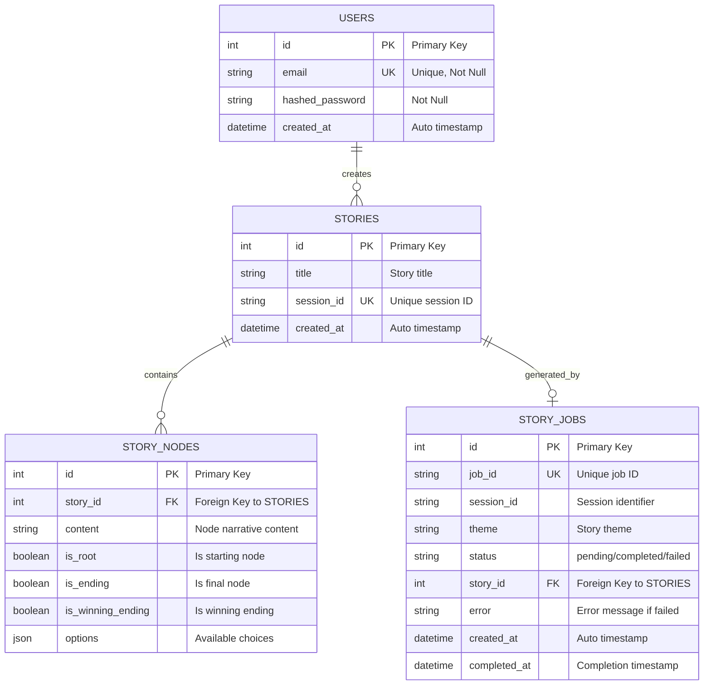
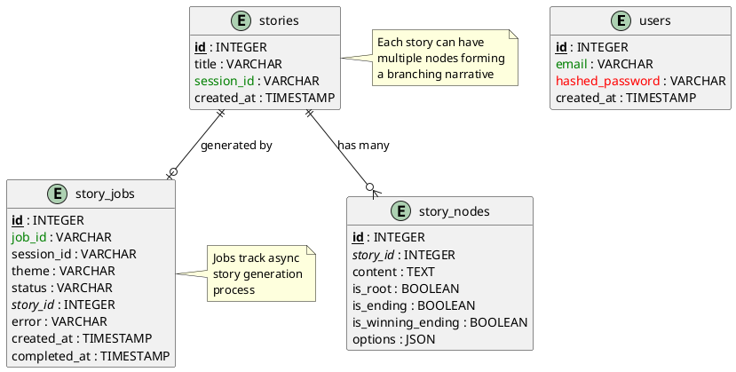

# Diagrama ER - Database Schema

Este documento contém o Modelo Entidade-Relacionamento do banco de dados em diferentes formatos.

---

## 📊 Diagrama Visual (Mermaid)



---

## 🗂️ Formato DBML (Database Markup Language)

Use em: https://dbdiagram.io

```dbml
// Use DBML to define your database structure
// Docs: https://dbml.dbdiagram.io/docs

Table users {
  id integer [primary key, increment, note: 'Auto-incrementing ID']
  email varchar [unique, not null, note: 'User email address']
  hashed_password varchar [not null, note: 'Bcrypt hashed password']
  created_at timestamp [default: `now()`, note: 'Account creation time']
  
  Indexes {
    id [name: 'idx_users_id']
    email [name: 'idx_users_email']
  }
}

Table stories {
  id integer [primary key, increment, note: 'Auto-incrementing ID']
  title varchar [note: 'Generated story title']
  session_id varchar [unique, note: 'Unique session identifier']
  created_at timestamp [default: `now()`, note: 'Story creation time']
  
  Indexes {
    id [name: 'idx_stories_id']
    title [name: 'idx_stories_title']
    session_id [name: 'idx_stories_session_id']
  }
}

Table story_nodes {
  id integer [primary key, increment, note: 'Auto-incrementing ID']
  story_id integer [ref: > stories.id, not null, note: 'Foreign key to stories']
  content text [note: 'Narrative content of the node']
  is_root boolean [default: false, note: 'True if starting node']
  is_ending boolean [default: false, note: 'True if ending node']
  is_winning_ending boolean [default: false, note: 'True if winning ending']
  options json [note: 'Array of choices as JSON']
  
  Indexes {
    id [name: 'idx_story_nodes_id']
    story_id [name: 'idx_story_nodes_story_id']
  }
}

Table story_jobs {
  id integer [primary key, increment, note: 'Auto-incrementing ID']
  job_id varchar [unique, not null, note: 'Unique job identifier (UUID)']
  session_id varchar [note: 'Session identifier']
  theme varchar [note: 'Story theme/prompt']
  status varchar [note: 'Job status: pending, completed, failed']
  story_id integer [ref: > stories.id, note: 'Foreign key to generated story']
  error varchar [note: 'Error message if job failed']
  created_at timestamp [default: `now()`, note: 'Job creation time']
  completed_at timestamp [note: 'Job completion time']
  
  Indexes {
    id [name: 'idx_story_jobs_id']
    job_id [name: 'idx_story_jobs_job_id']
    session_id [name: 'idx_story_jobs_session_id']
  }
}

// Relationships
Ref: story_nodes.story_id > stories.id [delete: cascade]
Ref: story_jobs.story_id > stories.id [delete: set null]
```

---

## 🔷 Formato PlantUML

Use em: http://www.plantuml.com/plantuml/uml/



---

## 📐 SQL DDL (Data Definition Language)

```sql
-- ============================================
-- Interactive Story Generator - Database Schema
-- ============================================

-- Users Table
CREATE TABLE users (
    id INTEGER PRIMARY KEY AUTOINCREMENT,
    email VARCHAR(255) UNIQUE NOT NULL,
    hashed_password VARCHAR(255) NOT NULL,
    created_at TIMESTAMP DEFAULT CURRENT_TIMESTAMP,
    
    -- Indexes
    INDEX idx_users_id (id),
    INDEX idx_users_email (email)
);

-- Stories Table
CREATE TABLE stories (
    id INTEGER PRIMARY KEY AUTOINCREMENT,
    title VARCHAR(500),
    session_id VARCHAR(100) UNIQUE,
    created_at TIMESTAMP DEFAULT CURRENT_TIMESTAMP,
    
    -- Indexes
    INDEX idx_stories_id (id),
    INDEX idx_stories_title (title),
    INDEX idx_stories_session_id (session_id)
);

-- Story Nodes Table
CREATE TABLE story_nodes (
    id INTEGER PRIMARY KEY AUTOINCREMENT,
    story_id INTEGER NOT NULL,
    content TEXT,
    is_root BOOLEAN DEFAULT FALSE,
    is_ending BOOLEAN DEFAULT FALSE,
    is_winning_ending BOOLEAN DEFAULT FALSE,
    options JSON,
    
    -- Foreign Key
    FOREIGN KEY (story_id) REFERENCES stories(id) ON DELETE CASCADE,
    
    -- Indexes
    INDEX idx_story_nodes_id (id),
    INDEX idx_story_nodes_story_id (story_id)
);

-- Story Jobs Table
CREATE TABLE story_jobs (
    id INTEGER PRIMARY KEY AUTOINCREMENT,
    job_id VARCHAR(100) UNIQUE NOT NULL,
    session_id VARCHAR(100),
    theme VARCHAR(500),
    status VARCHAR(50),
    story_id INTEGER,
    error TEXT,
    created_at TIMESTAMP DEFAULT CURRENT_TIMESTAMP,
    completed_at TIMESTAMP,
    
    -- Foreign Key
    FOREIGN KEY (story_id) REFERENCES stories(id) ON DELETE SET NULL,
    
    -- Indexes
    INDEX idx_story_jobs_id (id),
    INDEX idx_story_jobs_job_id (job_id),
    INDEX idx_story_jobs_session_id (session_id)
);
```

---

## 📊 Descrição Detalhada das Tabelas

### 1. `users` - Usuários do Sistema

| Coluna | Tipo | Restrições | Descrição |
|--------|------|------------|-----------|
| **id** | INTEGER | PRIMARY KEY, AUTO INCREMENT | Identificador único do usuário |
| **email** | VARCHAR | UNIQUE, NOT NULL, INDEX | Email do usuário (usado para login) |
| **hashed_password** | VARCHAR | NOT NULL | Senha criptografada com bcrypt |
| **created_at** | TIMESTAMP | DEFAULT CURRENT_TIMESTAMP | Data de criação da conta |

**Relacionamentos:**
- Futuramente: Um usuário pode criar várias histórias (1:N com `stories`)

---

### 2. `stories` - Histórias Geradas

| Coluna | Tipo | Restrições | Descrição |
|--------|------|------------|-----------|
| **id** | INTEGER | PRIMARY KEY, AUTO INCREMENT | Identificador único da história |
| **title** | VARCHAR | INDEX | Título gerado pela IA |
| **session_id** | VARCHAR | UNIQUE, INDEX | Identificador único da sessão |
| **created_at** | TIMESTAMP | DEFAULT CURRENT_TIMESTAMP | Data de criação |

**Relacionamentos:**
- **1:N** com `story_nodes` - Uma história tem vários nós
- **1:1** com `story_jobs` - Uma história é gerada por um job

---

### 3. `story_nodes` - Nós da Narrativa

| Coluna | Tipo | Restrições | Descrição |
|--------|------|------------|-----------|
| **id** | INTEGER | PRIMARY KEY, AUTO INCREMENT | Identificador único do nó |
| **story_id** | INTEGER | FOREIGN KEY, NOT NULL, INDEX | Referência à história pai |
| **content** | TEXT | - | Conteúdo narrativo do nó |
| **is_root** | BOOLEAN | DEFAULT FALSE | Se é o nó inicial |
| **is_ending** | BOOLEAN | DEFAULT FALSE | Se é um nó final |
| **is_winning_ending** | BOOLEAN | DEFAULT FALSE | Se é um final vitorioso |
| **options** | JSON | - | Array de opções/escolhas |

**Relacionamentos:**
- **N:1** com `stories` - Vários nós pertencem a uma história

**Estrutura JSON de `options`:**
```json
[
  {
    "text": "Go north to the castle",
    "next_node_id": 2
  },
  {
    "text": "Go south to the village",
    "next_node_id": 3
  }
]
```

---

### 4. `story_jobs` - Jobs de Geração Assíncrona

| Coluna | Tipo | Restrições | Descrição |
|--------|------|------------|-----------|
| **id** | INTEGER | PRIMARY KEY, AUTO INCREMENT | Identificador único do job |
| **job_id** | VARCHAR | UNIQUE, NOT NULL, INDEX | UUID do job |
| **session_id** | VARCHAR | INDEX | Identificador da sessão |
| **theme** | VARCHAR | - | Tema fornecido pelo usuário |
| **status** | VARCHAR | - | Status: `pending`, `completed`, `failed` |
| **story_id** | INTEGER | FOREIGN KEY, NULLABLE | Referência à história gerada |
| **error** | TEXT | NULLABLE | Mensagem de erro se falhou |
| **created_at** | TIMESTAMP | DEFAULT CURRENT_TIMESTAMP | Início do job |
| **completed_at** | TIMESTAMP | NULLABLE | Fim do job |

**Relacionamentos:**
- **1:1** com `stories` - Um job gera uma história

**Estados do Job:**
- `pending` - Job iniciado, aguardando processamento
- `completed` - História gerada com sucesso
- `failed` - Erro na geração (veja campo `error`)

---

## 🔗 Relacionamentos Detalhados

### 1. `stories` ←→ `story_nodes` (One-to-Many)

```
stories (1) ────────┐
                    │
                    │ has many
                    │
                    └─────── (N) story_nodes
```

**SQLAlchemy:**
```python
# models/story.py
class Story(Base):
    nodes = relationship("StoryNode", back_populates="story")

class StoryNode(Base):
    story_id = Column(Integer, ForeignKey("stories.id"))
    story = relationship("Story", back_populates="nodes")
```

**Cascade:** `ON DELETE CASCADE` - Deletar história deleta todos os nós

---

### 2. `stories` ←→ `story_jobs` (One-to-One)

```
stories (1) ────────┐
                    │
                    │ generated by
                    │
                    └─────── (1) story_jobs
```

**Cascade:** `ON DELETE SET NULL` - Deletar história mantém job mas limpa `story_id`

---

## 🎯 Cenários de Uso

### Cenário 1: Criar Nova História

```sql
-- 1. Criar job
INSERT INTO story_jobs (job_id, session_id, theme, status)
VALUES ('uuid-123', 'session-456', 'medieval fantasy', 'pending');

-- 2. Gerar história (background)
INSERT INTO stories (title, session_id)
VALUES ('The Dragon Quest', 'session-456');

-- 3. Adicionar nós
INSERT INTO story_nodes (story_id, content, is_root, options)
VALUES (1, 'You stand before a castle...', TRUE, '[...]');

-- 4. Atualizar job
UPDATE story_jobs
SET status = 'completed', story_id = 1, completed_at = CURRENT_TIMESTAMP
WHERE job_id = 'uuid-123';
```

### Cenário 2: Buscar História Completa

```sql
-- Busca história com todos os nós
SELECT 
    s.id, s.title, s.session_id,
    n.id as node_id, n.content, n.is_root, n.options
FROM stories s
LEFT JOIN story_nodes n ON s.id = n.story_id
WHERE s.id = 1;
```

### Cenário 3: Verificar Status do Job

```sql
SELECT job_id, status, error, story_id, completed_at
FROM story_jobs
WHERE job_id = 'uuid-123';
```

---

## 🔧 Ferramentas para Visualizar

### Online (Recomendado)
1. **dbdiagram.io** - Cole o código DBML acima
   - URL: https://dbdiagram.io
   - ✅ Mais fácil e visual
   - ✅ Exporta para PNG/PDF/SQL

2. **PlantUML Online** - Cole o código PlantUML
   - URL: http://www.plantuml.com/plantuml/uml/
   - ✅ Gera diagramas UML

3. **Mermaid Live Editor** - Cole o código Mermaid
   - URL: https://mermaid.live
   - ✅ Funciona no GitHub/GitLab

### Desktop
1. **DBeaver** - Visualizador de banco de dados
   - Conecta no SQLite e mostra ER automaticamente

2. **MySQL Workbench** - Designer de BD
   - Importa SQL DDL e gera diagrama

3. **Visual Studio Code** - Com extensões
   - Extensão: "Mermaid Preview"
   - Extensão: "PlantUML"

---

## 📸 Preview do Diagrama

O diagrama gerado mostrará:

```
┌─────────────┐
│    USERS    │
└─────────────┘
      │ (future)
      │
      ↓
┌─────────────┐         ┌──────────────┐
│   STORIES   │←────────│  STORY_JOBS  │
└─────────────┘  1:1    └──────────────┘
      │
      │ 1:N
      ↓
┌─────────────┐
│ STORY_NODES │
└─────────────┘
```

---

## 🎨 Cores Sugeridas para Diagramas

- 🔵 **Azul** - Tabelas principais (stories, users)
- 🟢 **Verde** - Tabelas de relacionamento (story_nodes)
- 🟡 **Amarelo** - Tabelas de controle (story_jobs)
- 🔴 **Vermelho** - Chaves primárias
- 🟣 **Roxo** - Chaves estrangeiras

---

**Escolha o formato que preferir e visualize seu banco de dados!** 📊✨
